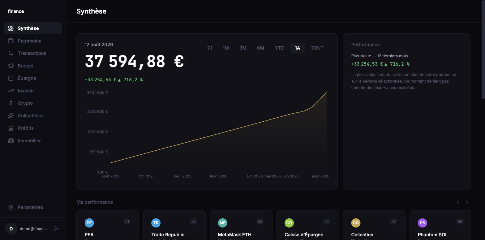
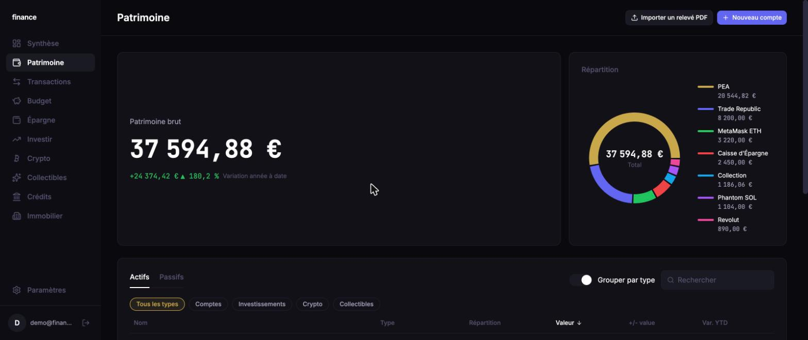
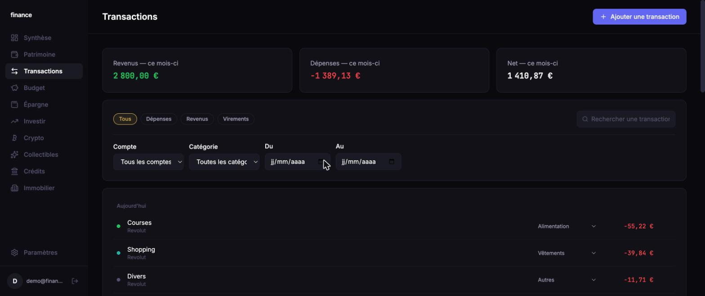
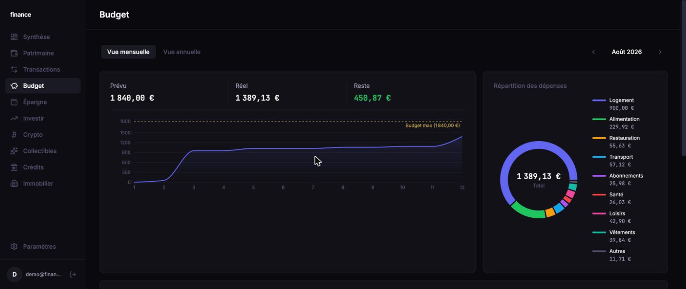
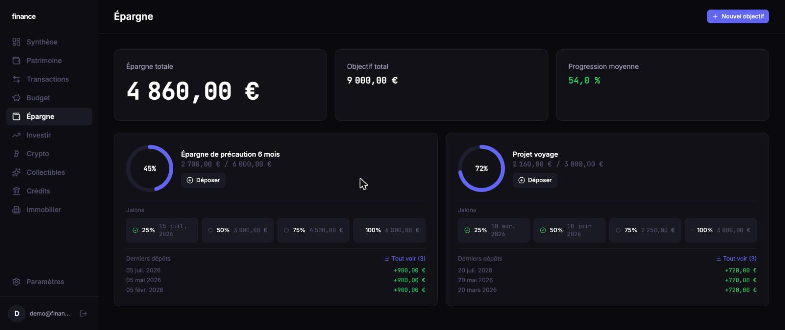
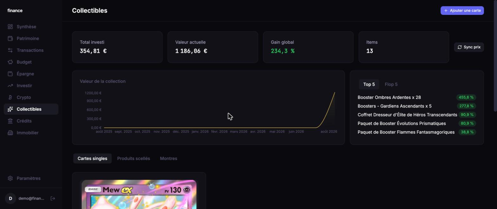

# Wallet Dashboard

Application desktop Mac de gestion de finances personnelles : comptes bancaires, budget, épargne, investissements, crypto, immobilier, crédits et collectibles Pokémon — le tout dans un seul dashboard, avec synchronisation automatique quand c'est possible et saisie manuelle sinon.

Electron + API REST Node/TypeScript + PostgreSQL, frontend React. La spec initiale du projet est dans [`base.md`](./base.md) ; ce README décrit l'état actuel, qui va largement au-delà de cette spec d'origine.



## Fonctionnalités

### Comptes (`Patrimoine` / `Comptes`)
- CRUD comptes courants / épargne / investissement, historique de solde quotidien
- **Import CSV multi-format** avec détection automatique (Revolut, Trade Republic, Caisse d'Épargne, BNC) et déduplication par hash
- **Import de relevés PDF** (Caisse d'Épargne et Revolut) : un même PDF peut regrouper plusieurs comptes (courant, livret, PEA numéraire...) — chaque section détectée est proposée à l'association avec un compte existant ou à la création d'un nouveau, et peut être routée vers le bon module (**Comptes**, **Épargne** ou **Investissements**) plutôt que d'atterrir systématiquement comme un simple compte bancaire. Le solde (y compris négatif/découvert) est mis à jour avec la valeur exacte déclarée par le relevé
- Synchronisation Revolut (OAuth2 PKCE) écrite et prête, en attente d'identifiants développeur Revolut réels pour être activée

### Transactions
- CRUD, filtres (compte / catégorie / type / période / recherche texte), pagination, stats par catégorie et par mois

### Budget
- Vue mensuelle et annuelle, génération automatique par copie du mois précédent, `actual_amount` recalculé dynamiquement depuis les transactions, répartition des dépenses par catégorie

### Épargne
- Objectifs (fonds d'urgence préconfiguré + objectifs personnalisés), dépôts horodatés, jalons automatiques à 25/50/75/100 %

### Investissements
- Comptes DCA avec journal d'entrées (versements, dividendes, frais de courtage), cours du jour via Alpha Vantage (conversion de devise automatique), objectifs personnalisés, simulateur de projection (intérêts composés), jalons cross-comptes 20K/50K/100K/1M €

### Crypto
- Wallets **lecture seule** (jamais de clé privée stockée) : Ethereum/EVM (Etherscan), Solana (RPC public), Binance, Bybit, Crypto.com, Meria
- Cours et logos via CoinGecko, P&L réel par token contre un coût d'acquisition saisi manuellement, historique de snapshots

### Immobilier
- Biens physiques, SCPI, crowdfunding immobilier ; historique de valorisation manuel horodaté

### Crédits
- Prêts avec échéancier, simulation de remboursement anticipé

### Collectibles (cartes Pokémon & scellé)
- Cartes singles via TCGdex (gratuit), scellé en saisie manuelle ou via providers optionnels (PokemonPriceTracker, Poketrace)
- Historique de prix éditable, cron de synchronisation, top/flop performers, valeur de collection dans le temps

### Transverse
- **Multi-devise d'affichage** (EUR/USD/CAD) : tout est stocké en euros, converti à l'affichage via des taux de change quotidiens
- **Déverrouillage Touch ID** sur Mac (hors spec initiale) — redonne accès au refresh token déjà stocké, pas un nouveau facteur d'authentification serveur
- **Compte démo** entièrement fonctionnel et réinitialisé à chaque connexion (voir plus bas)
- Design system sombre façon Finary (accent doré, Inter + JetBrains Mono pour les chiffres)

## Captures d'écran

| | |
|---|---|
|  |  |
|  |  |

<details>
<summary>Collectibles</summary>



</details>

## Stack

| Couche        | Techno                                                                             |
| ------------- | ---------------------------------------------------------------------------------- |
| Desktop shell | Electron                                                                           |
| Backend       | Node.js 20+, TypeScript strict, Express 5, PostgreSQL 16 via Drizzle ORM           |
| Frontend      | React 18, Vite, TailwindCSS v4, Recharts, TanStack Query, Zustand                  |
| Auth          | JWT (access 15min + refresh 7j en cookie httpOnly) + déverrouillage Touch ID (Mac) |
| Parsing       | `csv-parse` (imports CSV multi-format), `pdfjs-dist` (extraction de texte PDF sans dépendance binaire, imports de relevés bancaires) |
| Packaging     | electron-builder (.dmg Mac)                                                        |
| Tests         | Vitest + Supertest (178 tests backend)                                             |

## Structure

```
electron/   # Shell Electron (main + preload)
backend/    # API REST découplée (Express, modules par feature)
frontend/   # App React (Vite)
shared/     # Types TypeScript partagés backend/frontend
docs/       # Captures d'écran, notes
```

Backend organisé en modules MVC par feature sous `backend/src/modules/` (`auth`, `accounts`, `transactions`, `categories`, `budget`, `savings`, `investments`, `crypto`, `collectibles`, `credits`, `real-estate`, `settings`, `exchange-rates`) : chaque module a `controller` / `service` / `routes` / `schema` (Zod), les controllers ne contiennent jamais de logique métier. Intégrations externes isolées sous `backend/src/integrations/` (CSV, PDF, Etherscan, Solana, Binance, Bybit, Crypto.com, Meria, CoinGecko, Alpha Vantage, TCGdex).

## Prérequis

- Node.js 20+
- PostgreSQL 16 (local ou Docker)

## Setup

```bash
npm install
cp backend/.env.example backend/.env   # renseigner DATABASE_URL, JWT_SECRET (min 64 chars), ENCRYPTION_KEY
npm run db:migrate
```

Les clés API tierces (Etherscan, Crypto.com, Binance, Bybit, Meria, Alpha Vantage, PokemonPriceTracker, Poketrace, Revolut) ne se configurent **pas** via `.env` — elles se renseignent depuis `Réglages` une fois connecté à l'app, chiffrées en base.

Les tests backend utilisent une base Postgres séparée (`vitest.config.ts`, DB `wallet_dashboard_test`) pour ne jamais toucher aux données de dev — la créer et la migrer une fois :

```bash
createdb wallet_dashboard_test
DATABASE_URL=postgresql://<user>@localhost:5432/wallet_dashboard_test npm run db:migrate --workspace=backend
```

## Compte démo

Un compte démo est disponible directement depuis l'écran de connexion ("Accéder au compte démo") : `demo@finance.app` / `demo123`. Il est **réensemencé automatiquement à chaque connexion** avec un jeu de données réaliste sur tous les modules, et entièrement éditable (contrairement à un mode lecture seule) — seuls les réglages d'intégrations tierces (clés API) restent verrouillés en démo.

## Scripts

```bash
npm run dev          # lance backend + frontend + electron en parallèle
npm run build        # build backend + frontend + electron
npm run test         # tests backend (vitest)
npm run lint         # eslint sur tout le repo
npm run format       # prettier --write
npm run package:mac  # build + package .dmg
```

## État d'avancement

L'ensemble de la spec initiale (`base.md`) est implémenté : comptes, transactions, budget, épargne, investissements, crypto, collectibles, frontend complet et packaging Electron. Le projet a ensuite été étendu bien au-delà de cette spec au fil des besoins réels de l'utilisateur :

- Redesign complet du frontend (design system façon Finary)
- Déverrouillage Touch ID
- Devise d'affichage multi-devise (EUR/USD/CAD)
- Modules **Crédits** et **Immobilier** (hors spec initiale)
- Intégrations crypto réelles (Etherscan, Solana, Binance, Bybit, Crypto.com, Meria) et P&L par token
- Refonte de l'architecture Collectibles (TCGdex + providers optionnels, l'API Pokémon TCG initialement prévue étant devenue payante)
- Import de relevés bancaires **PDF** (Caisse d'Épargne, Revolut) en plus du CSV, avec routage intelligent vers Comptes/Épargne/Investissements
- Compte démo entièrement fonctionnel, réensemencé à chaque connexion

## Limites connues

- Synchronisation Revolut : code OAuth2 PKCE prêt mais jamais testé en conditions réelles (pas d'identifiants développeur Revolut)
- Crypto.com : intégration fonctionnelle mais dépendante de l'activation du produit Spot côté utilisateur
- Import PDF : seuls les formats Caisse d'Épargne et Revolut sont reconnus pour l'instant — un nouveau format nécessite un parseur dédié (architecture prévue pour, voir `backend/src/integrations/pdf/`)
